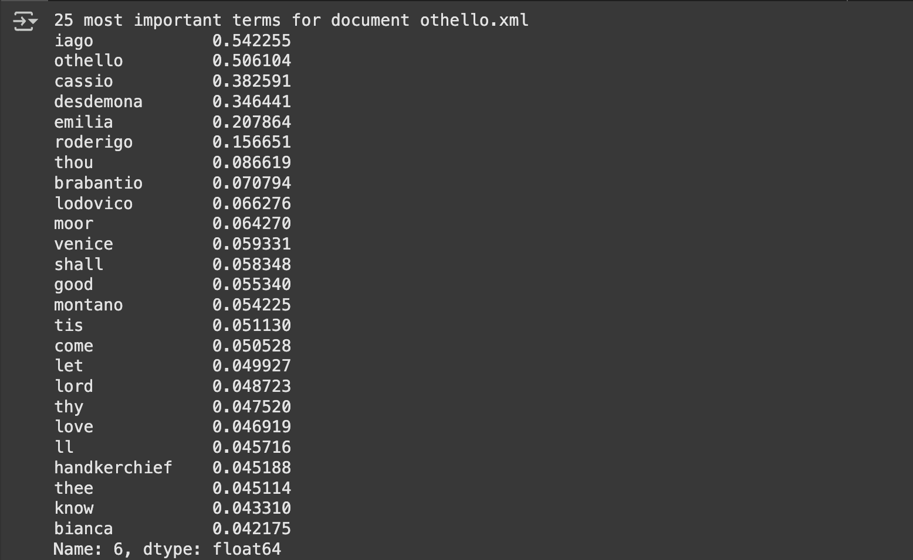

**Can you think on a situation where this binary weighting can be sufficient?**
When we want to classify something, like the presence of something in the text or a binary sentiment. For example, if a text is positive or not if contains certain word.

**What problem do you see with the most important words? Are they really representative?**
They're common connectors or words with no actual meaning so that we can extract relevant information from the text.

**What do you see now in the representation? Have we solved all the problems?**
We see a ratio, we've introduced the Inverse Document Frequency (IDF) wich measures how rare or common a word is across the entire corpus of documents. This will help us to get more information as rare words have a higher IDF, indicating they are more informative and important.

**What do you see now in the representation? Have we solved all the problems?**
We haven't solved all the problems, there's still a bunch of non relevant words in the top of the most important ones.

**Most relevant words for Othello**

**Using the Australian Broadcasting Commission 2006 (abc) corpus we can see a similar progress - I've analysed the second text in the bundle __science.txt__ with the following result.**

